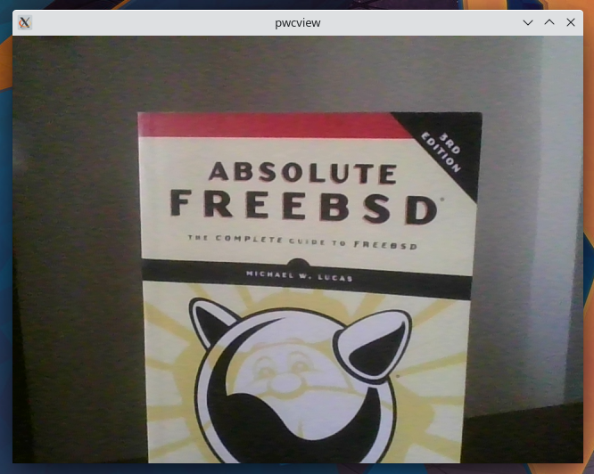

# 9.5. 视频会议

可以用 FreeBSD 的桌面环境来加入视频会议。本节将说明如何配置网络摄像头以及 FreeBSD 支持哪些视频会议软件。

## 9.5.1. 设置网络摄像头

为了使 FreeBSD 能够访问网络摄像头并进行配置，有必要安装一些软件：

- [multimedia/webcamd](https://cgit.freebsd.org/ports/tree/multimedia/webcamd/) 是一个守护程序，能够使用数百个不同的基于 USB 的网络摄像头和 DVB USB 设备。
- [multimedia/pwcview](https://cgit.freebsd.org/ports/tree/multimedia/pwcview/) 是一个可以用来查看网络摄像头视频流的软件。

运行命令安装需要的软件：

```
# pkg install webcamd pwcview
```

在 `/etc/rc.conf` 中启用 [webcamd(8)](https://man.freebsd.org/cgi/man.cgi?query=webcamd&sektion=8&format=html) 服务以在系统启动时启动它：

```
# sysrc webcamd_enable="YES"
```

该用户必须属于 `webcamd` 组。要将该用户添加到 `webcamd` 组，请执行以下命令：

```
# pw groupmod webcamd -m username
```

由于 [multimedia/webcamd](https://cgit.freebsd.org/ports/tree/multimedia/webcamd/) 需要 [cuse(3)](https://man.freebsd.org/cgi/man.cgi?query=cuse&sektion=3&format=html) 模块，必须通过执行以下命令来加载该模块：

```
# kldload cuse
```

要在系统启动时加载 [cuse(3)](https://man.freebsd.org/cgi/man.cgi?query=cuse&sektion=3&format=html)，执行命令：

```
# sysrc kld_list += "cuse"
```

在安装了这些软件后，就可以用 [webcamd(8)](https://man.freebsd.org/cgi/man.cgi?query=webcamd&sektion=8&format=html) 来显示可用的网络摄像机的列表：

```
# webcamd -l
```

输出结果看起来像这样：

```
webcamd [-d ugen0.2] -N SunplusIT-Inc-HP-TrueVision-HD-Camera -S unknown -M 0  ①
webcamd [-d ugen1.3] -N Realtek-802-11n-WLAN-Adapter -S 00e04c000001 -M 0
```

① 可用的 webcam

要配置可用的网络摄像头，执行以下命令：

```
# sysrc webcamd_0_flags="-d ugen0.2"
```

> **注意**
>
> 请注意，如果这是一个即插即用的 USB 网络摄像头，改变它所连接的 USB 端口将改变 `webcamd -l` 的输出，并且可能需要更新 rc.conf 中的条目。对于使用 USB 集成网络摄像头的笔记本电脑，这不应该是一个问题。

必须通过执行以下命令启动 [webcamd(8)](https://man.freebsd.org/cgi/man.cgi?query=webcamd&sektion=8&format=html) 服务：

```
# service webcamd start
```

输出结果看起来应该像这样：

```
Starting webcamd.
webcamd 1616 - - Attached to ugen0.2[0]
```

[multimedia/pwcview](https://cgit.freebsd.org/ports/tree/multimedia/pwcview/) 可以用来检查网络摄像头的正常功能。下面的命令可以用来执行 [ multimedia/pwcview](https://cgit.freebsd.org/ports/tree/multimedia/pwcview/)：

```
% pwcview -f 30 -s vga
```

然后 [multimedia/pwcview](https://cgit.freebsd.org/ports/tree/multimedia/pwcview/) 将显示网络摄像头：



## 9.5.2. 会议软件状态

FreeBSD 目前支持以下用于进行视频会议的工具。

**表 19. 会议软件**
| 名称 | Firefox 状态 | Chromium 状态 | 网址 |
| :-: | :-: | :-: | :-: |
| Microsoft Teams | 不支持 | 支持 | [https://teams.live.com](https://teams.live.com/) |
| Google Meet | 不支持 | 支持 | [https://meet.google.com/](https://meet.google.com/) |
| Zoom | 支持 | 支持 | [https://zoom.us](https://zoom.us/) |
| Jitsi | 不支持 | 支持 | [https://meet.jit.si/](https://meet.jit.si/) |
| BigBlueButton | 不支持 | 支持 | [https://bigbluebutton.org/](https://bigbluebutton.org/) |